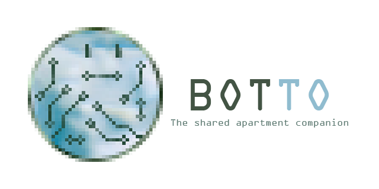

# 

Botto is a client side application that functions as a telegram chat bot to organise your shared apartment life. 
It can run on any device that supports python and has and internet connection

Thanks to [my friend](https://www.artstation.com/rm0) who generated the artwork for this project.
